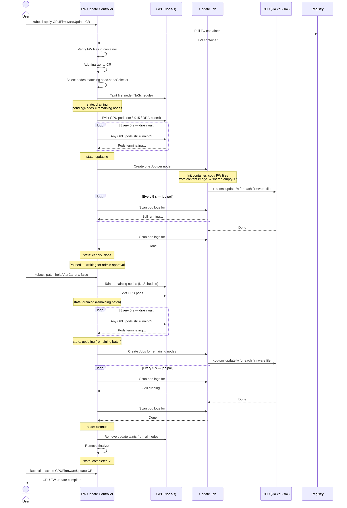

# GPU Firmware Update

The operator manages firmware updates for Intel GPUs through the `GPUFirmwareUpdate` custom resource. Updates are performed by running a Kubernetes `Job` on each target node that executes the `xpu-smi` tool via the `scripts/update.sh` script.

Two underlying update methods are supported, selected per firmware file type:
- **igsc** – updates through the MEI (Management Engine Interface) on the host; requires detecting the GPU's BDF address.
- **AMC** – updates through a Redfish interface via an external component; no host-side device detection needed, but requires credentials.

## Rough flow for executing a GPU firmware update

* Container with FW files is created and stored in a registry
  * `cp *.bin fwfiles/`
  * `make fwfiles-build`
  * `docker tag docker.io/intel/gpu-firmware-update-files:devel <some registry>/intel-gpu-fwupdate-files:v0.0.1`
  * `docker push <some registry>/intel-gpu-fwupdate-files:v0.0.1`
* (Optional but recommended) Generate checksums for the firmware files using the helper script and add them to the CR YAML. See [Firmware checksum verification](#firmware-checksum-verification).
* Label nodes which should be updated
  * `kubectl label node <gpu node> gpu-update=true`
  * In the future, use label with GPU FW to target nodes.
* Prepare FW update CR and apply it. See examples in the [samples](config/samples/fwupdate/).
  * `kubectl apply -k config/samples/fwupdate`
* Observe FW update progress from the GPUFirmwareUpdate's status
  * `watch kubectl get gpufirmwareupdates.intel.com <cr-name> -o yaml`
* Once done, remove the update CR
  * `kubectl delete -k config/samples/fwupdate`

## Background for update containers

The GPU FW update process works by utilizing two different containers: FW update files container and XPU-SMI tool container. The main reason for this split is that the firmware files are larger than 1MB which is the maximum file size in ConfigMap. The update Job combines these two container images by copying FW files to the context of the XPU-SMI tool. More details below.

To create a GPU FW files container, place the update files in the `fwfiles` directory of the project, and build the container:

```
cp ~/Downloads/bmg_gfx_file.bin fwfiles/
make fwfiles-build
```
The command will produce a container image called: `docker.io/intel/gpu-firmware-update-files:devel`

For the XPU-SMI container image, one can build your own image with the included Dockerfile, or use a pre-existing container image with XPU-SMI.

To build the container, call:

```
make fwupdater-build
```

It will produce a container image called `docker.io/intel/gpu-fwupdater:devel`

To use these container images within the GPU FW update, they need to be placed in a registry where they can be accessed. The image path need to be also
set in the `GPUFirmwareUpdate` resource that initiates the update:

```
spec:
  updaterImage: docker.io/intel/gpu-fwupdater:devel
  content:
    containerImage: docker.io/intel/gpu-firmware-update-files:devel
```

More details below.

## Update process overview

The controller is a state machine. After a `GPUFirmwareUpdate` CR is created it moves through the following states:

**direct mode** (`spec.updateMethod: direct`):
```
not_started → draining → updating → cleanup → completed
                                  ↘ error_cleanup → error
```

**canary mode** (`spec.updateMethod: canary`):
```
not_started → draining → updating → canary_done → draining → updating → cleanup → completed
              (1 node)    (1 node)   (auto or      (remaining) (remaining)
                                     gated)
```

### Sequence diagram

Happy path canary update with `holdAfterCanary`.



### 1. Node selection and tainting (`not_started` → `draining`)

The controller evaluates all nodes matching `spec.nodeSelector` up front. The `spec.updateMethod` field controls how many are processed in the first batch:

| `spec.updateMethod` | First batch | Remaining nodes |
|---|---|---|
| `direct` | All matching nodes | — |
| `canary` | One node only | Held in `status.nodeInfos.pendingNodes` until canary succeeds |

All selected nodes are:
1. Tainted with `spec.updateTaint` (default: `gpufirmware-update`, effect `NoSchedule`) to stop new GPU workloads from scheduling on them.
2. Existing GPU pods on the node are evicted (deleted). Both extended-resource pods (`gpu.intel.com/xe`, `gpu.intel.com/i915`) and DRA-based pods are detected.

Only the current batch is tainted immediately. Pending nodes are tainted when the rollout promotes to full.

A finalizer (`gpufirmwareupdate.intel.com/finalizer`) is added to the CR so nodes are always untainted even if the CR is deleted mid-flight.

### 2. Drain wait (`draining`)

The controller requeues every 5 seconds and checks whether GPU pods have finished terminating on the current batch of nodes. Once all nodes are drained it moves to the `updating` state.

### 3. Firmware update Jobs (`updating`)

One Kubernetes `Job` is created per node in the current batch (nodes already in `status.nodeInfos.completedNodes` are skipped). Each Job has:
- An **init container** (`fw-copy`) that copies firmware files out of the firmware content image into a shared in-memory `emptyDir` volume at `/update/`.
- A main **updater container** (`updater`) running the `xpu-smi`-based container image. Its command calls `scripts/update.sh` once for each firmware file listed in `spec.content.files`.

The script invocation is:

```
sh /update/update.sh "<pciDeviceID>" "<firmwareType>" "/update/<fileName>"
```

Completion is detected by looking for the string `##COMPLETED##` in the Job pod's logs. The controller polls every 5 seconds until all Jobs have finished.

When all Jobs in the current batch succeed:
- **direct mode**: transitions to `cleanup`.
- **canary mode** with pending nodes remaining: transitions to `canary_done`.
- **canary mode** with no pending nodes (canary was the only matching node): transitions to `cleanup`.

### 4. Canary promotion (`canary_done`)

After the canary node's Job succeeds, the controller enters `canary_done`. Promotion to the full rollout is controlled by `spec.holdAfterCanary`:

| `spec.holdAfterCanary` | Behaviour |
|---|---|
| `false` (default) | Promotion happens automatically on the next reconciliation. |
| `true` | Controller waits (polling every 10 s) until `spec.holdAfterCanary` is set to `false`. |

On promotion, the remaining nodes from `status.nodeInfos.pendingNodes` are tainted and drained, and the state machine re-enters `draining` → `updating` for them.

> **Immutability**: once an update is in progress the webhook rejects changes to structural fields (see [Webhook protection](#webhook-protection)). `spec.holdAfterCanary` is always mutable so it can be set while the CR is in `canary_done`.

### 5. Cleanup (`cleanup` / `error_cleanup` → `completed` / `error`)

Once all Jobs across all phases are done the controller removes the `spec.updateTaint` taint from every node that was processed (both the canary node and the full-rollout nodes) and updates the CR status to `completed` (or `error` if any Job failed). At this point the finalizer is removed and the CR can be garbage-collected normally.

---

## Container images

Two separate container images are required — they must be built and published independently:

| Field | Purpose | What it must contain |
|---|---|---|
| `spec.updaterImage` | Runs `xpu-smi` to perform the update | The `xpu-smi` binary and `scripts/update.sh` (mounted from the firmware volume) |
| `spec.content.containerImage` | Supplies the firmware files | The firmware binary files under `/fwupdate/` |

The firmware content image is used only as an init container that copies its `/fwupdate/` directory into a shared in-memory volume. The updater container then reads the files from that volume at `/update/`. The two images are completely independent — updating the firmware files does not require rebuilding the updater image, and vice versa.

---

## Firmware checksum verification

Each entry in `spec.content.files` accepts an optional `checksum` field containing the SHA-256 digest of the firmware file:

```yaml
spec:
  content:
    containerImage: registry.example.com/gpu-firmware:2026.3@sha256:<digest>
    files:
      - type: GFX
        filename: gfx_fw.bin
        checksum: "sha256:1596a533bde7114c2af1541ec3819842c9e763643fc10dcd1f2b4a3ee6ffebbc"
      - type: GFX_DATA
        filename: gfx_data_fw.bin
        checksum: "sha256:eb9d278a7459f7589e22874c98c02d7584362572f1c596d8cbd6a09ae3615437"
```

### What it does

When the controller processes a new `GPUFirmwareUpdate` CR it performs a pre-flight check against the content image **before** any node is tainted or drained:

| Checksums declared? | Check performed |
|---|---|
| None | Full image pull + file existence check under `/fwupdate/` |
| One or more | Full image pull + SHA-256 verification of every declared file under `/fwupdate/` |

If a checksum does not match, or a declared file is missing from the image, the CR enters the `error` state and no nodes are touched.

### Digest-pinning requirement

Whenever **any** file has a `checksum` set the webhook enforces that `spec.content.containerImage` must be digest-pinned (i.e. contain `@sha256:`). This eliminates the TOCTOU window between the operator's pre-flight verification and the DaemonSet image pull on the nodes — both are guaranteed to use exactly the same image bytes.

```yaml
# Accepted — digest-pinned
containerImage: registry.example.com/gpu-firmware:v2026.1@sha256:abcd1234...

# Rejected by webhook when any checksum is set — only tag-based
containerImage: registry.example.com/gpu-firmware:v2026.1
```

### Private or self-signed registries

If the content image registry uses a self-signed certificate or a private CA, set `spec.insecureSkipTLSVerify: true` to skip TLS certificate verification for the operator's pre-flight calls:

```yaml
spec:
  insecureSkipTLSVerify: true
  content:
    containerImage: myregistry.internal/gpu-firmware@sha256:...
```

> **Note:** this flag only affects the operator's reachability/checksum checks. The actual firmware-update DaemonSet image pull is performed by the node's container runtime and is governed by its own TLS configuration (e.g. `/etc/containerd/config.toml`).

---

igsc-based updates use the MEI interface on the host. `xpu-smi` requires the GPU's BDF (Bus:Device.Function) address, which the script discovers by scanning `/sys/class/drm/card?/device`.

The update command run inside the Job container is:

```sh
xpu-smi updatefw -y -d <BDF> -t <type> -f <firmwareFile> [--force]
```

### Example CR

```yaml
apiVersion: intel.com/v1alpha1
kind: GPUFirmwareUpdate
metadata:
  name: gfx-update
spec:
  updateMethod: canary
  pciDeviceID: "0x56c0"
  updateTaint: gpufirmware-update
  nodeSelector:
    gpu-update: "true"
  updaterImage: intel/xpumanager:v1.3.4
  imagePullSecret: my-registry-secret
  content:
    containerImage: registry.example.com/gpu-firmware@sha256:abcd1234...
    files:
      - type: GFX
        filename: gfx_fw.bin
        checksum: "sha256:1596a533bde7114c2af1541ec3819842c9e763643fc10dcd1f2b4a3ee6ffebbc"
      - type: GFX_DATA
        filename: gfx_data_fw.bin
        checksum: "sha256:eb9d278a7459f7589e22874c98c02d7584362572f1c596d8cbd6a09ae3615437"
```

> The `containerImage` must be digest-pinned (`@sha256:`) whenever any `checksum` field is set.

This CR uses `canary` mode, which will automatically promote to the full rollout after the first node succeeds. To require manual approval before the full rollout, add:

```yaml
  holdAfterCanary: true
```

Then approve the full rollout with:

```sh
kubectl patch gpufirmwareupdate gfx-update --type=merge -p '{"spec":{"holdAfterCanary":false}}'
```

---

## AMC update

AMC updates go through a Redfish interface on an external component, so there is no need to detect the GPU's BDF address on the host. The `xpu-smi` tool handles device targeting internally. Because the Redfish interface requires authentication, a Kubernetes Secret must be provided.

### Secret format

Create a Secret in the **operator namespace** with keys `username` and `password`:

```yaml
apiVersion: v1
kind: Secret
metadata:
  name: amc-credentials
  namespace: <operator-namespace>
type: Opaque
stringData:
  username: admin
  password: s3cr3t
```

The operator injects these into the update Job as the environment variables `AMC_USERNAME` and `AMC_PASSWORD`.

The update command run inside the Job container is:

```sh
xpu-smi updatefw -y -t AMC -f <firmwareFile> -u $AMC_USERNAME -p $AMC_PASSWORD
```

### Example CR

```yaml
apiVersion: intel.com/v1alpha1
kind: GPUFirmwareUpdate
metadata:
  name: amc-update
spec:
  updateMethod: direct
  pciDeviceID: ""              # not used for AMC; can be left empty
  updateTaint: gpufirmware-update
  nodeSelector:
    gpu-update: "true"
  amcCredentialsSecret: amc-credentials   # must be in the operator namespace
  updaterImage: intel/xpumanager:v1.3.4
  content:
    containerImage: registry.example.com/gpu-firmware@sha256:abcd1234...
    files:
      - type: AMC
        filename: amc_fw.bin
        checksum: "sha256:3739b855dd6b92df2f905a1c2cf6127efa03efc4862e063074e0ec8930bb5bb4"
```

> **Note:** `amcCredentialsSecret` is required whenever any entry in `spec.content.files` has `type: AMC`. The operator will reject the CR (set status to `error`) if the field is missing.

---

## Advanced topics

### Firmware types

The following firmware file types are supported (set in `spec.content.files[].type`):

| Type | Method used | Notes |
|---|---|---|
| `GFX` | igsc | `--force` flag is added automatically |
| `GFX_DATA` | igsc | |
| `GFX_CODE_DATA` | igsc | |
| `GFX_PSCBIN` | igsc | |
| `AMC` | AMC (Redfish) | Requires `spec.amcCredentialsSecret` |
| `FAN_TABLE` | igsc | |
| `VR_CONFIG` | igsc | |
| `OPROM_CODE` | igsc | |
| `OPROM_DATA` | igsc | |

### Webhook protection

A validating admission webhook prevents editing structural spec fields while an update is in progress (states: `draining`, `updating`, `canary_done`, `cleanup`, `error_cleanup`). Attempting to change any of the following fields while in one of those states will be rejected:

| Field | Reason |
|---|---|
| `spec.updaterImage` | Already encoded in running Jobs |
| `spec.updateMethod` | Nodes are already selected and tainted for the original method |
| `spec.nodeSelector` | Node selection has already happened |
| `spec.pciDeviceID` | Already encoded in running Jobs |
| `spec.content` | Firmware files and image already in use by running Jobs |
| `spec.amcCredentialsSecret` | Credentials already injected into running Jobs |
| `spec.updateTaint` | Taint key already applied to nodes; cleanup depends on it |

The following fields remain mutable at any time:

| Field | Notes |
|---|---|
| `spec.holdAfterCanary` | Must be mutable to allow promotion from `canary_done`. Allows flow to continue after canary update. |
| `spec.tolerations` | Does not affect already-running Jobs |

Additionally, the webhook enforces the following rules on **any** create or update operation (regardless of state):

| Rule | Details |
|---|---|
| Digest-pinning when checksums are set | If any `spec.content.files[].checksum` is non-empty, `spec.content.containerImage` must contain `@sha256:`. Tag-based references are rejected to prevent TOCTOU between the operator's pre-flight check and the DaemonSet image pull on the nodes. |

---

### CR status

| `status.state` | Meaning |
|---|---|
| `` (empty) | Not yet started |
| `draining` | Current batch of nodes is tainted; waiting for GPU pods to terminate |
| `updating` | Firmware update Jobs are running for the current batch |
| `canary_done` | Canary node succeeded; waiting to promote to full rollout (automatic or gated) |
| `cleanup` | All Jobs succeeded; removing taints from all nodes |
| `error_cleanup` | One or more Jobs failed; removing taints from all nodes |
| `completed` | Update finished successfully on all nodes |
| `error` | Update finished with errors |

`status.nodeInfos` sub-fields:

| Field | Contents |
|---|---|
| `allNodes` | All nodes that have been tainted (grows as canary promotes to full) |
| `pendingNodes` | Nodes selected but not yet tainted (canary mode only; cleared on promotion) |
| `drainingNodes` | Nodes in the current batch still waiting for GPU pods to terminate |
| `updatingNodes` | Nodes whose Jobs are currently running |
| `completedNodes` | Nodes whose Jobs finished successfully (accumulates across both phases) |
| `errorNodes` | Nodes whose Jobs failed |
| `jobs` | Names of all Kubernetes Jobs created (accumulates across both phases) |

`status.messages` contains human-readable progress and error messages appended throughout the process.

### Considerations on aborting the flow

The operator protects the custom resource via a finalizer that it removes at the end of the update flow. If the update process has to be stopped, there are three states where the operator allows the delete to succeed:

* Operator has not yet started the update - State of the process is empty (=not started)
* Operator is draining the nodes - FW update is not yet done.
* Canary update is done and the operator is waiting for admin's go-ahead.

> **NOTE**: If needed, it's possible to remove the finalizer and then remove the GPU FW update custom resource. That will also remove any Jobs tied to the resource object, which could cause active FW update to fail and leave the GPU in a broken state.
